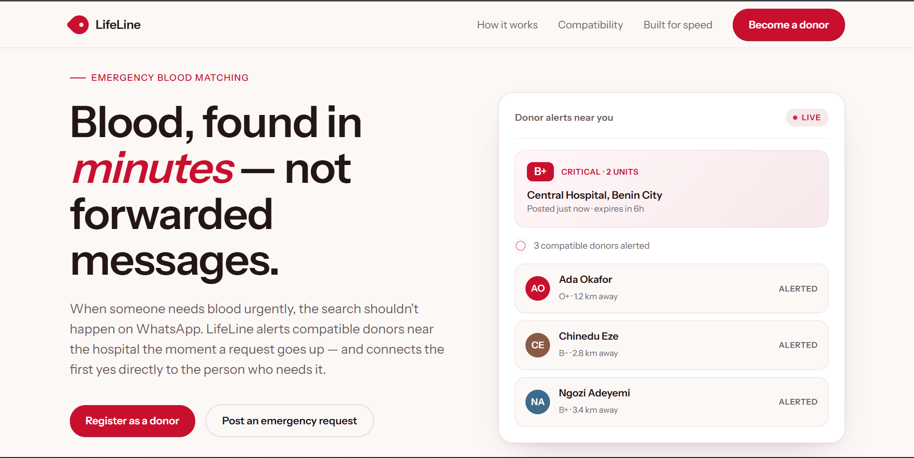
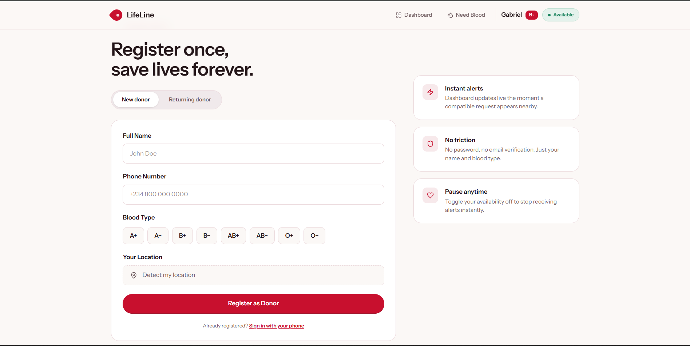
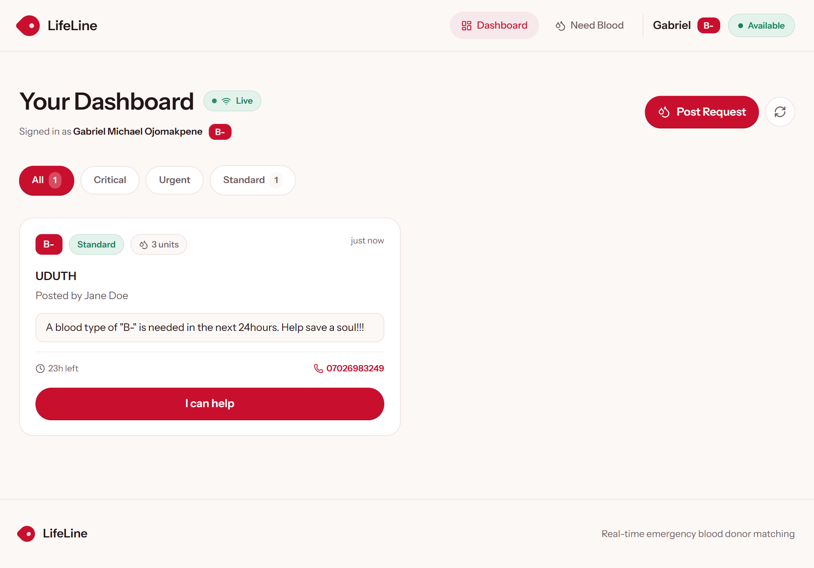
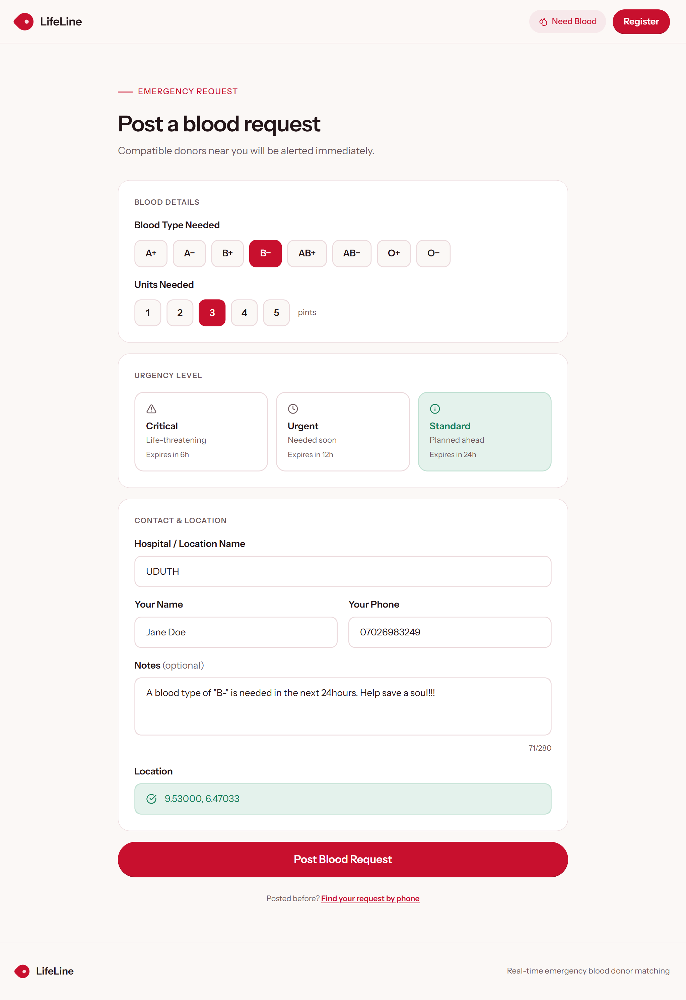
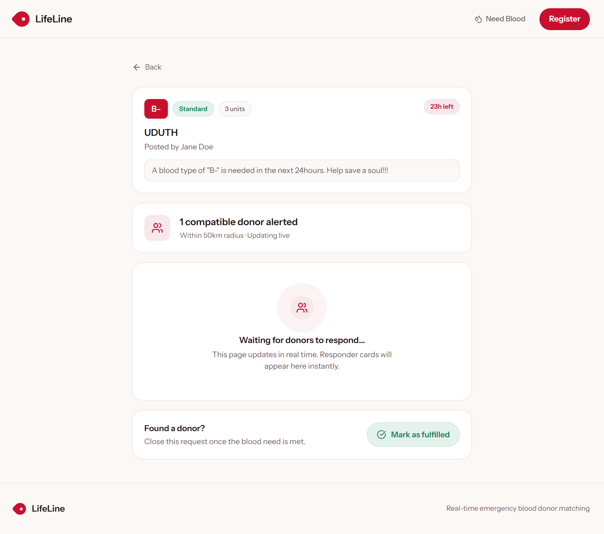

# LifeLine

> Real-time emergency blood request matching — from post to donor contact in under a minute.

[](./LICENSE)
[](https://www.typescriptlang.org/)
[](https://nodejs.org/)

---

## Problem Statement

When someone needs blood urgently, the current search process is broken. Families post to WhatsApp groups, forward messages through chains, and manually call strangers — all while the clock runs down. Compatible donors exist, but there is no fast, direct path between a request and the people who can answer it.

Every minute of delay in accessing blood during an emergency increases the risk of fatality. The gap is not a supply problem; it is a **coordination problem**.

---

## Solution Overview

LifeLine is a real-time blood request matching platform. Hospital staff or a patient's family posts a request — blood type, urgency level, and location — and LifeLine immediately alerts every compatible, available donor within range.

- Donors register once with their blood type and location
- Requests are matched against blood-type compatibility rules and geolocation
- Matching donors receive a live alert the moment a request goes up
- The first donor to respond gets phone numbers exchanged with the requester directly
- Requests expire automatically and are closed by the requester once fulfilled

No app to install for requesters. No feed to scroll. One focused flow on each side.

---

## Features

| Feature | Description |
|---|---|
| **Instant donor alerts** | Compatible donors are notified via WebSocket within 1 second of a request being posted |
| **Blood-type compatibility engine** | Respects full ABO/Rh donation rules — not just exact matches |
| **Expanding geosearch** | Matching radius starts at 5 km and widens to 15 km, then 50 km until enough donors are reached |
| **Returning donor sign-in** | Donors re-authenticate by phone number — no password required |
| **Duplicate prevention** | Phone-indexed find-or-create ensures one account per donor regardless of re-registration |
| **Session persistence** | Active requests survive page refresh and browser close via localStorage |
| **Phone-based request recovery** | Requesters who lose their tab can find their request by entering their phone number |
| **Request fulfillment** | Requester closes the request with a two-step confirm; all donor dashboards update instantly |
| **Auto-expiry** | Requests expire based on urgency (6h critical / 12h urgent / 24h standard) and disappear from all dashboards |
| **Push notifications** | Donors and requesters receive browser push notifications even when the tab is closed, with deep-link navigation on click |
| **JWT authentication** | Bearer-token auth on all donor-specific endpoints — no session storage on the server |
| **Fully responsive UI** | Works on all screen sizes from 320px mobile to wide desktop |

---

## Technology Stack

### Monorepo

| Layer | Tool |
|---|---|
| Package manager | npm workspaces |
| Shared types | `packages/shared` (TypeScript, consumed by both apps) |

### Server (`apps/server`)

| Concern | Technology |
|---|---|
| Runtime | Node.js 20+ |
| Framework | Express 5 |
| Database | MongoDB via Mongoose 9 |
| Real-time | Socket.io 4 |
| Auth | JSON Web Tokens (`jsonwebtoken`) |
| Validation | `express-validator` |
| Logging | Pino |
| Security | Helmet, CORS |
| Language | TypeScript 6 |

### Web (`apps/web`)

| Concern | Technology |
|---|---|
| Framework | React 19 |
| Build tool | Vite 6 |
| Styling | Tailwind CSS v4 |
| Routing | React Router v7 |
| State management | Zustand v5 (with `persist` middleware) |
| Real-time client | Socket.io-client 4 |
| Icons | Lucide React |
| Language | TypeScript 5 |

---

## Project Structure

```
lifeline/
├── apps/
│   ├── server/                  # Express API + Socket.io server
│   │   ├── controllers/         # Request handlers
│   │   ├── middlewares/         # Auth + validation middleware
│   │   ├── models/              # Mongoose schemas
│   │   ├── routes/              # API route definitions
│   │   ├── services/            # Business logic layer
│   │   ├── sockets/             # Socket.io event handlers
│   │   ├── utils/               # Token signing, response helpers, constants
│   │   ├── validators/          # express-validator rule sets
│   │   └── app.ts               # Server entry point
│   │
│   └── web/                     # React SPA
│       └── src/
│           ├── components/
│           │   ├── landing/     # Landing page sections
│           │   ├── register/    # Registration form components
│           │   ├── create-request/   # Request form components
│           │   ├── dashboard/   # Dashboard UI components
│           │   └── request-status/  # Status page components
│           ├── lib/             # API client, socket factory, time utils
│           ├── pages/           # Route-level page components
│           └── store/           # Zustand stores
│
└── packages/
    └── shared/                  # Types, blood-type compatibility, constants
```

---

## Prerequisites

- **Node.js** v20 or higher
- **npm** v9 or higher
- A **MongoDB** instance (Atlas free tier works)

---

## Installation

### 1. Clone the repository

```bash
git clone https://github.com/your-username/lifeline.git
cd lifeline
```

### 2. Install all dependencies

```bash
npm install
```

This installs dependencies for the root, `apps/server`, `apps/web`, and `packages/shared` in one command via npm workspaces.

### 3. Generate VAPID keys for push notifications

Push notifications require a VAPID key pair. Generate one using the `web-push` CLI — no installation needed:

```bash
npx web-push generate-vapid-keys
```

This prints something like:

```
Public Key:
BLv5EYYIfZbkSRgMXkP0-RMlgwB88IeCBpp2PWeiW4mZeaLeS-o6byzgjdVoQB_mwuGtIwaKrYjRBwks91oobg8

Private Key:
r0tlMjufQaQ4zf1Dr24zZPjr1TUAAxFC_EaSAIXcEsc
```

Keep both values — you will need them in the next step. The public key goes in **both** the server and web environment files. The private key goes in the server only and must never be exposed to the browser.

### 4. Configure environment variables

**Server** — copy and fill in your values:

```bash
cp apps/server/.env.example apps/server/.env
```

```env
PORT=5000
DATABASE_URI=mongodb+srv://<user>:<password>@cluster.mongodb.net/lifeline
NODE_ENV=development
CORS_ORIGINS=http://localhost:5173
JWT_SECRET=your-secret-key-here
JWT_EXPIRES_IN=30d
VAPID_PUBLIC_KEY=<your generated public key>
VAPID_PRIVATE_KEY=<your generated private key>
VAPID_EMAIL=mailto:you@example.com
```

**Web** — copy and fill in your values:

```bash
cp apps/web/.env.example apps/web/.env
```

```env
VITE_API_URL=http://localhost:5000
VITE_SOCKET_URL=http://localhost:5000
VITE_VAPID_PUBLIC_KEY=<your generated public key — same value as server>
```

### 5. Seed the database (optional)

Populate the database with sample donors for development:

```bash
npm run seed --workspace=@lifeline/server
```

---

## Running the Application

### Development (both apps in parallel)

```bash
npm run dev
```

Or run each app independently:

```bash
npm run dev:server   # API server on http://localhost:5000
npm run dev:web      # Vite dev server on http://localhost:5173
```

### Production build

```bash
npm run build
npm run start
```

---

## Usage Guide

### For Requesters (hospital staff / patient family)

1. Navigate to the home page and click **"Post an emergency request"**
2. Select the required blood type and units needed
3. Choose an urgency level — Critical, Urgent, or Standard
4. Fill in the hospital name, your name, and your phone number
5. Detect your location and submit
6. You will be taken to a live status page showing how many donors were alerted and any responders as they come in
7. Once a donor makes contact and the need is met, click **"Mark as fulfilled"** to close the request

**Lost your status page?** Scroll to the bottom of the request form and use **"Find your request by phone"** to recover your session.

### For Donors

1. Click **"Become a donor"** or **"Register as a donor"** from the landing page
2. Enter your name, phone number, and blood type
3. Detect your location and submit
4. You will be taken to your live dashboard showing compatible requests near you
5. Click **"I can help"** on any request to respond — the requester's contact details will be shared with you
6. **Returning?** Use the "Returning donor" tab on the register page and enter your phone number to sign back in

---

## API Reference

### Donors

| Method | Endpoint | Auth | Description |
|---|---|---|---|
| `POST` | `/api/donors` | — | Register a new donor (or update existing) |
| `POST` | `/api/donors/lookup` | — | Sign in by phone number |
| `GET` | `/api/donors/:id` | — | Get donor profile |
| `PATCH` | `/api/donors/:id` | Bearer | Update donor profile |

### Requests

| Method | Endpoint | Auth | Description |
|---|---|---|---|
| `POST` | `/api/requests` | — | Post a blood request |
| `POST` | `/api/requests/lookup` | — | Find active request by requester phone |
| `GET` | `/api/requests/nearby` | Bearer | Get compatible requests near the donor |
| `GET` | `/api/requests/:id` | — | Get a single request |
| `POST` | `/api/requests/:id/respond` | Bearer | Respond to a request as a donor |
| `POST` | `/api/requests/:id/fulfill` | — | Mark a request as fulfilled |

### Push Notifications

| Method | Endpoint | Auth | Description |
|---|---|---|---|
| `GET` | `/api/push/vapid-key` | — | Get the server's VAPID public key |
| `POST` | `/api/push/subscribe` | Bearer | Subscribe a donor's device for push alerts |
| `POST` | `/api/push/subscribe-request` | — | Subscribe a requester's device to a specific request |
| `DELETE` | `/api/push/unsubscribe` | — | Remove a push subscription |

### Socket.io Events

| Event | Direction | Payload | Description |
|---|---|---|---|
| `donor:online` | Client → Server | `{ bloodType }` | Register donor as available |
| `request:watch` | Client → Server | `{ requestId }` | Subscribe to a request room |
| `request:new` | Server → Client | `BloodRequest` | New compatible request appeared |
| `request:accepted` | Server → Client | `Responder` | A donor responded to the request |
| `request:fulfilled` | Server → Client | `{ requestId }` | Request has been closed |

---

## Screenshots

> Screenshots below show the core user flows.

**Landing Page**


**Donor Registration**


**Donor Dashboard**


**Create Request**


**Request Status**



---

## Key Engineering Decisions

**Denormalized responder snapshots** — When a donor responds, their name, phone, and blood type are written directly into the responder subdocument. This keeps the status page readable after a page refresh without requiring a join, and ensures responder data is never affected by future donor profile updates.

**JWT over sessions** — Donors authenticate with a 30-day Bearer token stored in Zustand + localStorage. The server is fully stateless — no session store needed, and horizontal scaling is straightforward.

**Find-or-create over upsert** — Donor deduplication uses a `findOne` then `create` pattern rather than `findOneAndUpdate` with `upsert`. This gives precise control over what fields are updated on re-registration and avoids TypeScript type ambiguity in Mongoose's rawResult overloads.

**REST for state, WebSocket for events** — Initial page data is fetched over REST (predictable, cacheable, easy to debug). Only live updates — new requests, new responders, fulfillment — travel over Socket.io. This keeps the app functional even when the WebSocket connection drops.

---

## Challenges Overcome

**Duplicate donor accounts** — Every registration created a new record. Resolved with a unique index on the phone field at the database level, combined with a find-or-create pattern in the service layer for graceful handling.

**Anonymous responders on refresh** — Donor names disappeared after page reload because the responder subdocument only stored the donor ID. Resolved by snapshotting name, phone, and blood type into the subdocument at response time.

**Lost requester sessions** — Requesters who closed the tab had no way back to their status page. Resolved with Zustand `persist` middleware for localStorage continuity and a phone-based request lookup as a fallback entry point.

---

## Future Scope

- **Donor availability scheduling** — configurable active hours instead of a binary on/off toggle
- **Hospital dashboard** — a multi-request management view for medical staff with fulfillment history
- **Analytics** — response-time metrics and donor coverage heatmaps per region
- **Native mobile app** — React Native port for background notifications and offline support

---

## Team

| Name | Role | Contact |
|---|---|---|
| Gabriel Michael Ojomakpene | Full-stack Engineer | codewitgabi222@gmail.com |

---

## License

This project is licensed under the [MIT License](./LICENSE).

---

<p align="center">Built for the moments when minutes matter.</p>
